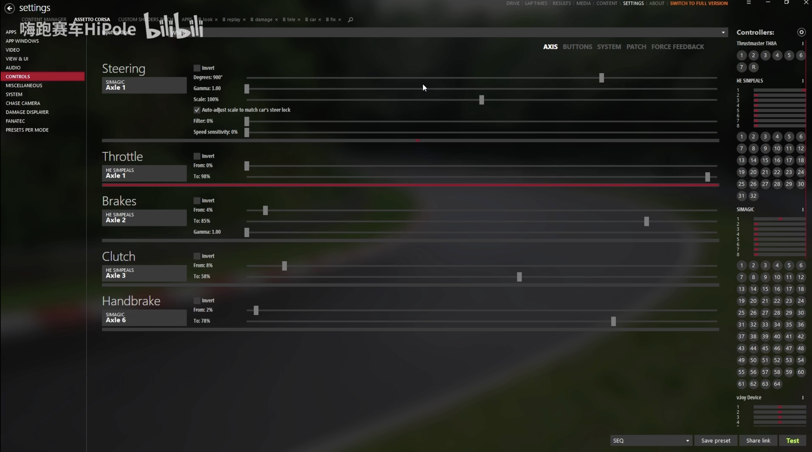
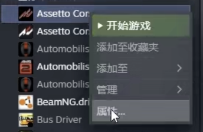
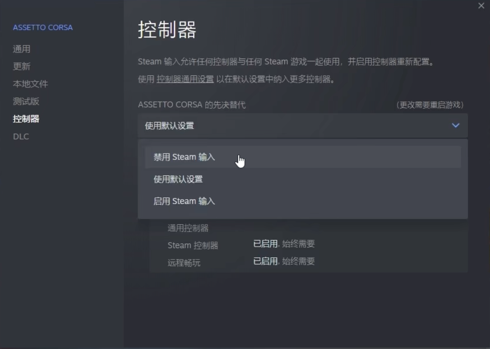
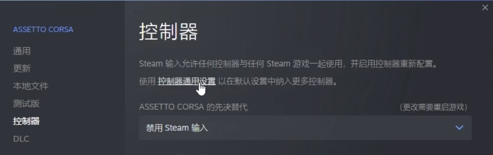
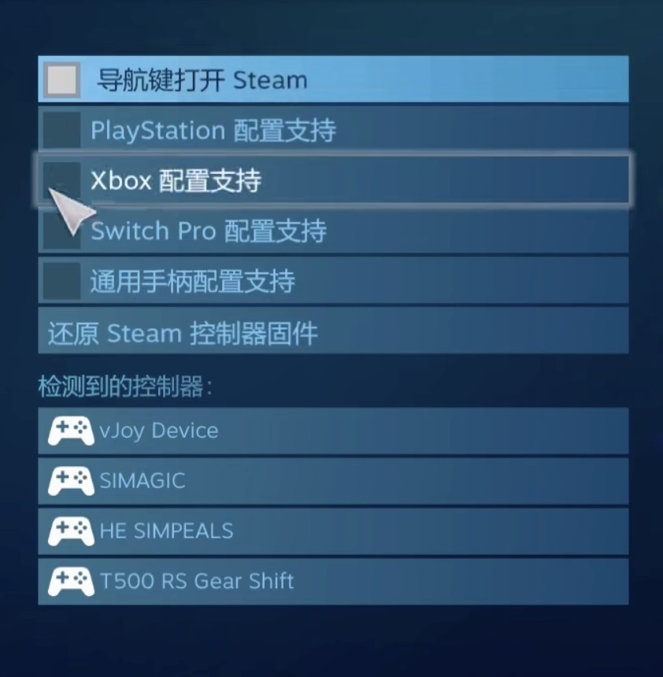
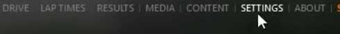
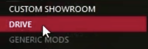

# 本地游戏问题诊断

## 崩溃或无法进入

### *无弹窗加载中直接退出，并在CM启动器显示比赛结束*

##### 错误原因
`不明原因导致的崩溃`
##### 解决方案
- 可能是比赛模式选择错误，请在CM启动器选择练习赛模式进入游戏

------
### *使用如GTR-R32的部分车辆（多为日系车）后进入游戏加载途中闪退，但是使用其他车辆正常*
##### 错误原因
`DLC缺失导致的验证失败闪退`
##### 解决方案
- 购买车辆所需的DLC-[DLC购买]()

------
### *点击出发按钮后一直显示加载csp*
##### 错误原因
`不明，可能是太长时间或从未打开地图造成的缓存缺失`
##### 解决方案
- 在启动器内找到本地游戏生涯模式任意关卡开始游戏，成功进入并能游玩后，退出游戏再试

------

## 进入游戏后出现问题

### *进入游戏后地图贴图丢失，只有蓝色建模*
##### 错误原因
`CSP或SOL出错，或是微软运行库版本错误`
##### 解决方案
- 在steam检测游戏完整性，如果仍然不行，进入地图文件夹，找到本mod的.kn5模型文件，并选择用CM启动器打开，查看是否能加载贴图。如果可以加载，说明微软运行库和CSP和SOL没有问题，只需重新安装mod本体，如果不能加载，请重新安装微软运行库，和mod运行库以及mod本体。

------
### *进入游戏后无法发动车辆，但是可以切换视角等操作*
##### 错误原因
`以错误模式进入地图`
##### 解决方案
- 以正赛或赛道日模式进入地图，测试以练习赛模式进入，如果仍出现此错误，尝试TODO：发动车辆键位

------
### *进入游戏后天空全黑*
##### 错误原因
`CSP出错或SOL版本不兼容导致的天气加载失败`
##### 解决方案
- 安装最新版本的SOL，如果已经安装请重新安装，

## 操控出现错误

### *CM启动器内可以正常识别方向盘或手柄，但是进入游戏内仍无法操控*
##### 错误原因
`CM启动器和steam产生冲突`
##### 解决方案
- 确认方向盘或手柄驱动已经安装，CM启动器的AC-操控页面中可以正常检测到方向盘状态，且在其他直接从steam打开的游戏中可以正常使用方向盘设备或手柄

  

- 打开steam，找到神力科莎，右键选择属性

  

找到`控制器`，选择禁用steam输入，然后关闭窗口并重启游戏，查看问题是否已经解决

  

- 如果仍然不行，点击控制器通用设置，进入后会弹出大屏幕模式

  

- 将除了`导航键打开steam`以外的选项全部取消勾选，然后查看是否在`检测到的控制器`一栏见到你的方向盘或手柄，如果没有则是驱动错误，请重装驱动

  

- 设置完毕后点击下方的返回，关闭steam设置窗口，重启steam和cm启动器，然后进入游戏，查看问题是否解决。如果仍有此错误，请打开CM，找到顶部栏`CONTENT MANAGER`（CM）→ 菜单栏`SETTINGS` → 侧边栏`DRIVE`

  

  

  

- 找到右边的`AC-related events:`，勾选下方的`Automatically`，完全重启电脑。如果问题仍未解决，请关机，然后~~爬到桌子底下~~拔掉你的设备的连接线，然后开机，打开CM的控制界面，然后再把设备插入，查看是否识别，如果CM没有识别请重新启动CM，然后重新调整控制设置或恢复到默认设置，设置完毕后重新打开游戏即可，如果仍不行请尝试打开游戏自带地图。

------、

### *CM启动器内可以正常识别方向盘或手柄，但是进入游戏内仍无法操控*
##### 错误原因
`CM启动器和steam产生冲突`
##### 解决方案