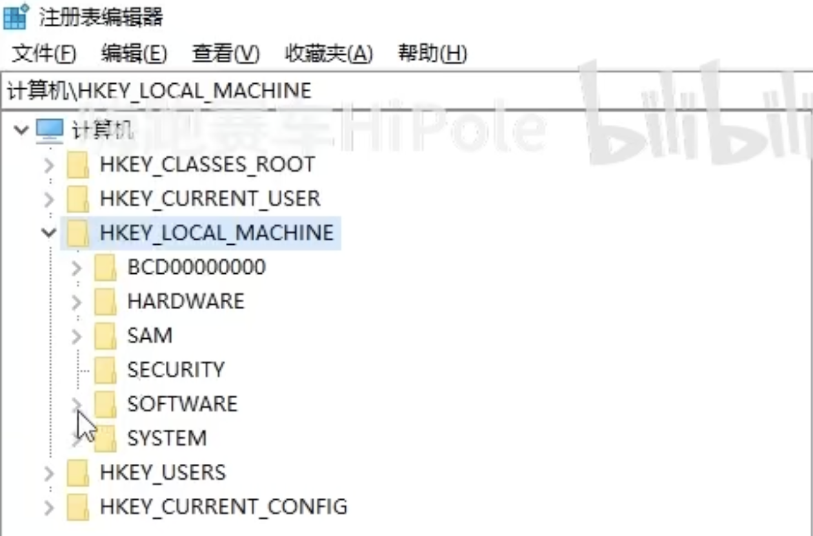
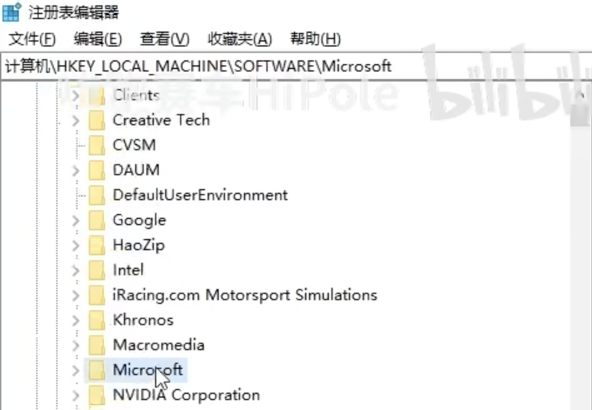
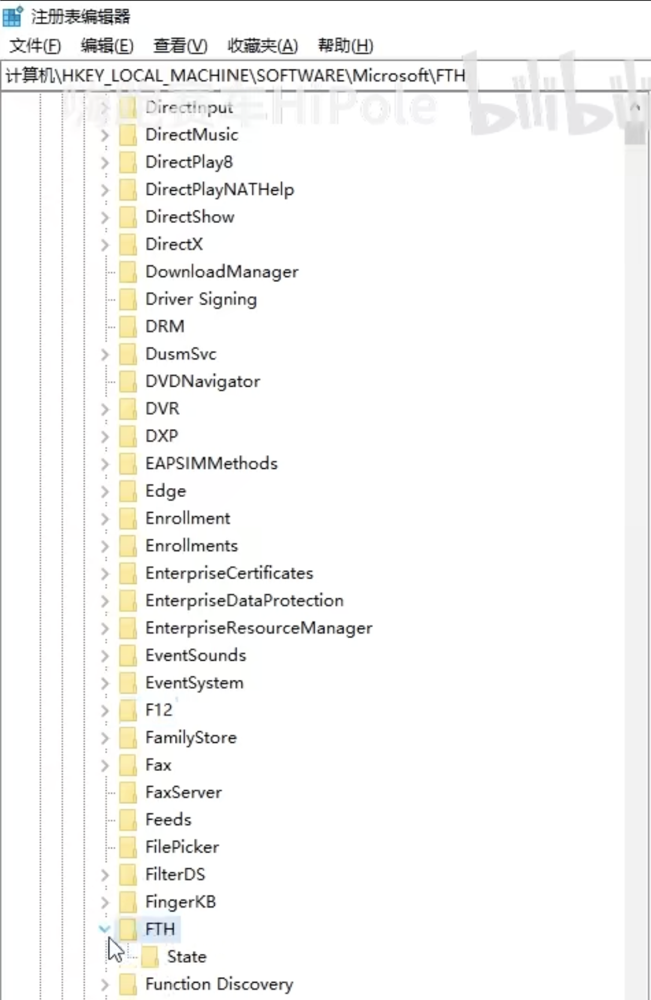
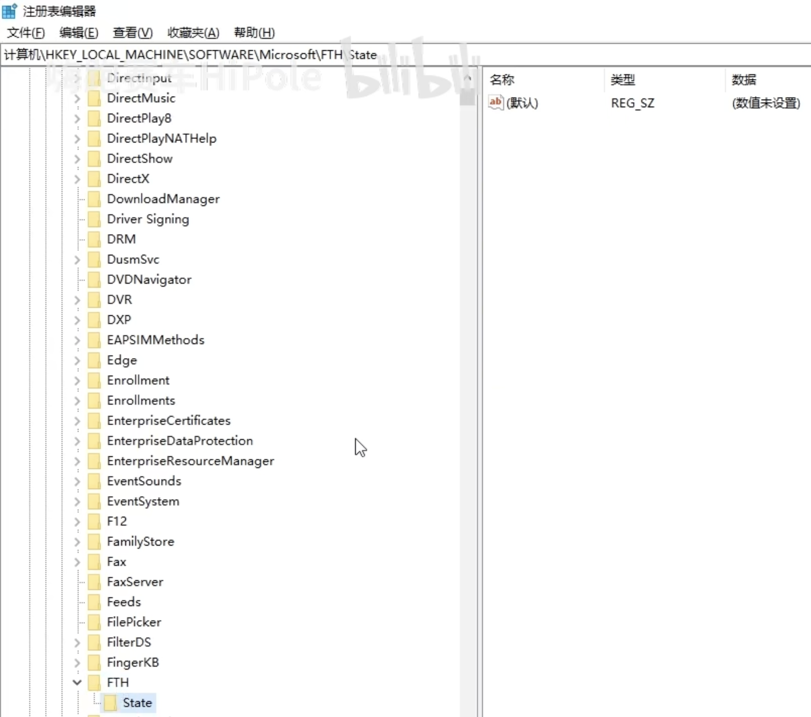
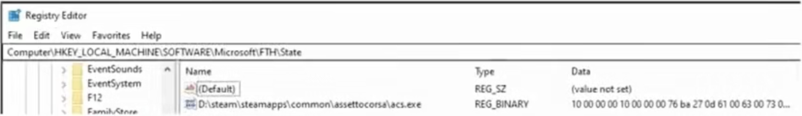
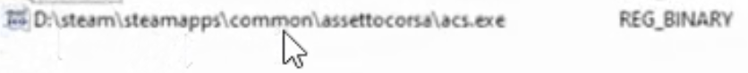

# AC启动器问题诊断和教程

## 设置问题

### *如何导入mod或插件？*

##### 解决方案

- 将下载的压缩包直接拖到CM启动器中，如果成功识别右上角的菜单栏将会显示绿色TODO：补充图片
- 有的

------

## mod和补丁问题

### *导入mod压缩包文件后无法识别，显示灰色*

##### 错误原因

`CM启动器只能检测可以直接放在游戏文件夹内的且只有一层的文件，例如赛道和车辆，如果是需要覆盖游戏根目录，或是多层包含多个包的文件会无法识别`

##### 解决方案

- 如果是需要覆盖根目录的文件，请先解压文件，然后进入解压出的文件夹，全部选择并复制粘贴到游戏根目录，
- 如果是多层包含多个包的文件，例如插件或赛道，车辆合集，需要自行解包，分类，例如将车辆文件统一放置到同一个文件夹，然后再拖入便可正常识别。

------

### *导入mod压缩包文件后无法识别，显示灰色*

##### 错误原因

`将同一个文件拖入两次`

##### 解决方案

## 其他问题

### *进入多人联机页面无法加载*

##### 错误原因

`账户绑定错误导致的游戏验证错误`

##### 解决方案

------

### *打开CM后不时卡顿（显卡和CPU占用未满）*

##### 错误原因

`不明原因`

##### 解决方案

使用win+r快捷键打开快捷命令窗口，输入regedit打开注册表编辑器

  

找到`HKEY LOCAL MACHINE`并进入

  

找到`Microsoft`并进入

  

找到`FTH`并进入 FTH会监测经常出现问题的软件，并建立一个白名单

  

进入State文件夹

  

查看是否有下图所示的`steam\steamapps\common\assettocorsal\acs.exe`的文件

  

  

如果没有，说明本方法无法解决你的问题，请尝试[重新安装CM]()

------

