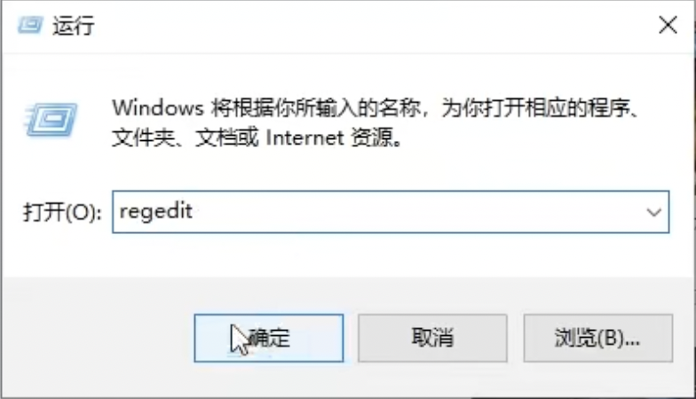
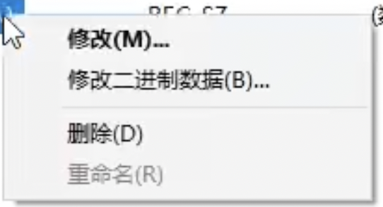
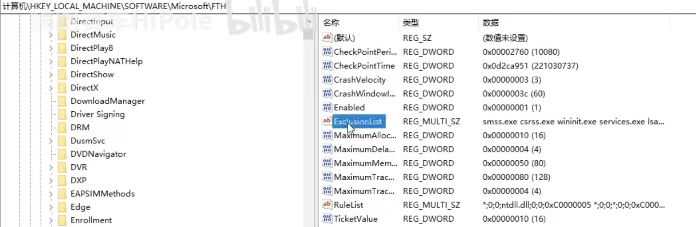
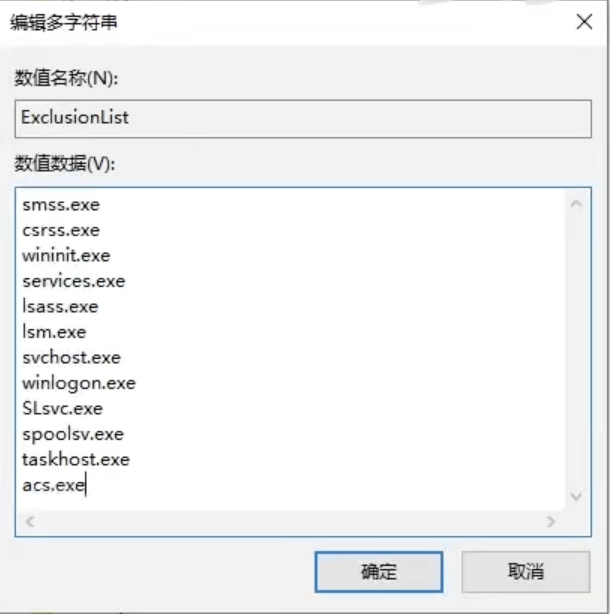

# AC启动器问题诊断和教程

## 设置问题

### *如何导入mod或插件？*

##### 解决方案

- 将下载的压缩包直接拖到CM启动器中，如果成功识别右上角的菜单栏将会显示绿色TODO：补充图片
- 有的

## 服务器问题

### *无法加载服务器列表*

##### 错误原因

`steam账号绑定错误或因为CSP无法识别复杂中文名导致的不工作`

##### 解决方案

- 换绑steam账号

进入CM界面的设置 → CM（CONTENT MANGER）→ 常规设置

`如果绑定的账户中有神力科莎但仍出现此错误请查看下一方法`

- 更改steam名

查看名称中是否有复杂中文名或特殊字符，如果有请更改，然后重启steam和CM再试。

`如果错误仍存在请查看下一方法`

- 清理CM缓存

进入CM界面的设置 → CM（CONTENT MANGER）→ 常规设置，找到右边的`数值缓存库`中的`打开应用文件夹按钮`和`打开日志文件夹`，点击这两个按钮，点击后会弹出两个文件夹页面，将文件夹内的文件全部删除（**不要删除文件夹本身！**），然后重新打开CM

`如果错误仍存在请查看下一方法`

- 检查服务器是否是最新版本-[查看最新版本]()

如果是最新版本请直接查看下一方法，如果不是最新版本，请安装最新版本的安装包，然后拖入到CM中，选择`先删除已有项目`，安装，重启CM，然后进入服务器。

`如果错误仍存在请查看下一方法`
- 重新安装CSP

------

## mod和补丁问题

### *导入mod压缩包文件后无法识别，显示灰色*

##### 错误原因

`CM启动器只能检测可以直接放在游戏文件夹内的且只有一层的文件，例如赛道和车辆，如果是需要覆盖游戏根目录，或是多层包含多个包的文件会无法识别`

##### 解决方案

- 如果是需要覆盖根目录的文件，请先解压文件，然后进入解压出的文件夹，全部选择并复制粘贴到游戏根目录，
- 如果是多层包含多个包的文件，例如插件或赛道，车辆合集，需要自行解包，分类，例如将车辆文件统一放置到同一个文件夹，然后再拖入便可正常识别。

------

### *导入mod压缩包文件后无法识别，显示灰色*

##### 错误原因

`将同一个文件拖入两次`

##### 解决方案
重启CM启动器后再拖入

------

### *已经导入车辆，但是在车辆列表中没有显示导入的车辆*

##### 错误原因

`将同一个文件拖入两次`

##### 解决方案
重启CM启动器后再拖入

## 其他问题

### *进入多人联机页面无法加载*

##### 错误原因

`账户绑定错误导致的游戏验证错误`

##### 解决方案

------

### *打开CM后不时卡顿（显卡和CPU占用未满）*

##### 错误原因

`windows会将常出问题的文件加入白名单，CM启动器在正常的运行中途产生错误时会频繁检测白名单造成卡顿`

##### 解决方案

使用win+r快捷键打开快捷命令窗口，输入regedit打开注册表编辑器

  

找到`HKEY LOCAL MACHINE`并进入

  

找到`Microsoft`并进入

  

找到`FTH`并进入，FTH会监测经常出现问题的软件，并建立一个白名单

  

进入State文件夹

  

查看是否有下图所示的`steam\steamapps\common\assettocorsal\acs.exe`的文件

  

  

如果没有，说明本方法无法解决你的问题，请尝试[重新安装CM]()，大概率可解决此问题。如果有此文件，右键点击选择删除即可

  

然后点击FTX文件夹，找到`ExclusionList`，左键双击打开

  

在弹出的编辑栏中添加`acs.exe`，点击确定以保存更改

  

保存后可能弹出类似的弹窗，直接点击确定即可

  

完成后直接关闭注册表，然后完全重启电脑便可解决问题

------
