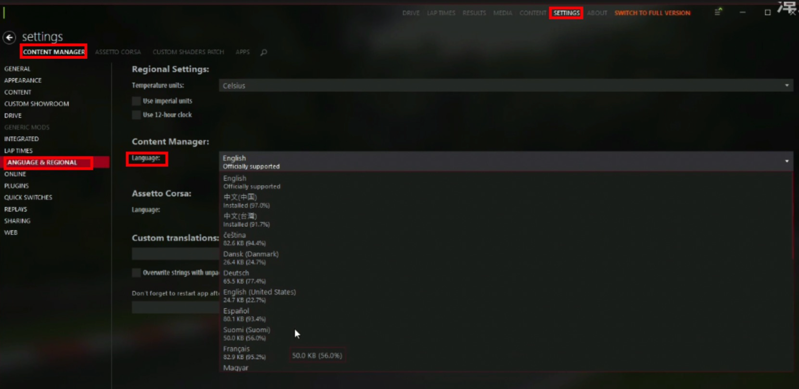

# CM启动器安装教程

### 基本设置

#### 初始设置
将下载的安装包拖到桌面，然后点击安装包，会弹出以下界面

在第一栏选择你的steam账号

#### 语言设置

  

点击顶部的`SETTINGS` → `LANGUAGE & REGIONAL`，在界面的`Language`选项中找到你想要的语言，点击，稍等片刻后点击下方的`Restart`按钮(重启按钮)即可，如果没有看到中文选项或选择并重启后未出现你设置的语言是正常现象，说明语言包还在加载，稍等2分钟后即可。

