# 什么是首都高？

## 现实原型

- **关于[首都高的历史](https://www.shutoko.co.jp/zh-CN/index/about/history/)**

首都高的现实原型为[日本东京首都高速公路](https://zh.wikipedia.org/wiki/首都高速道路)，简称首都高

首都高全线地图

 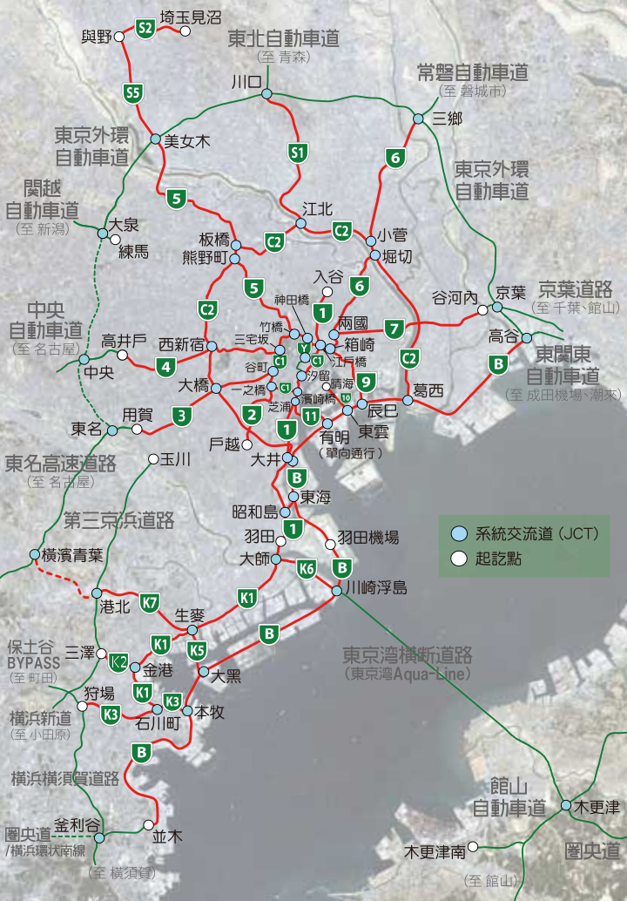 

首都高也被称为湾岸，得名于[湾岸线]()，是首都高在地下飙车的代表线路

​															`湾岸线全线地图`

 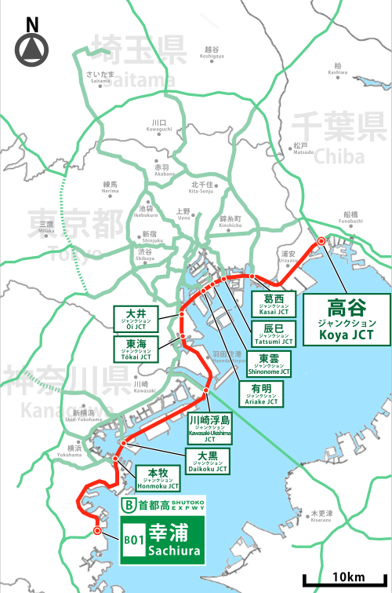 

​																`湾岸线的彩虹大桥`

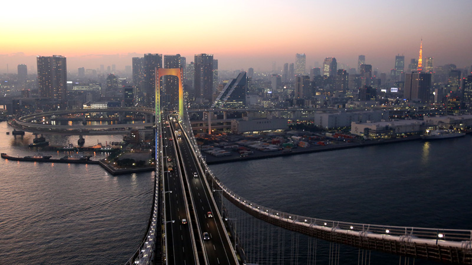

## 本模组

- 链接为维基百科词条，需要代理才能访问

本模组为神力科莎游戏的地图mod，目标为还原现实的首都高

### 目前已还原的线路

#### 湾岸线

`具有代表性的笔直线路，是冲击超高速的最佳地点`

湾岸线西行

 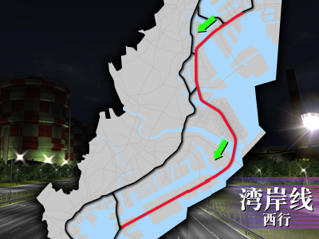 

湾岸线东行

 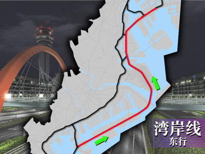 

[维基百科-湾岸线](https://zh.wikipedia.org/wiki/首都高速灣岸線)

#### C1高速都心环状线

`穿过诸如东京塔及汐留办公楼等特色建筑物的赛道，大小弯道很多`

C1外回

 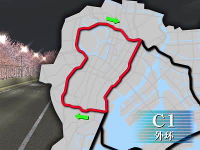 

C1内回

 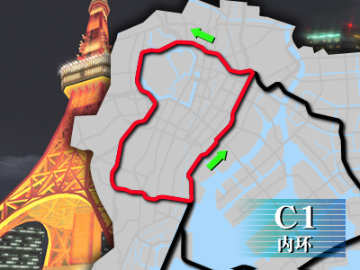 

**[维基百科-C1高速都心环状线](https://zh.wikipedia.org/wiki/首都高速道路都心環狀線)**

#### 新环状线

`该赛道的特征是它不止有直道与高速弯道，也恰到好处地配置了技术弯道区。`

新环状左环

 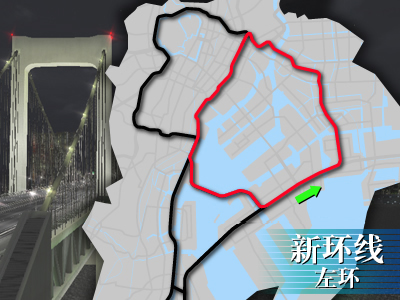 

新环状右环

 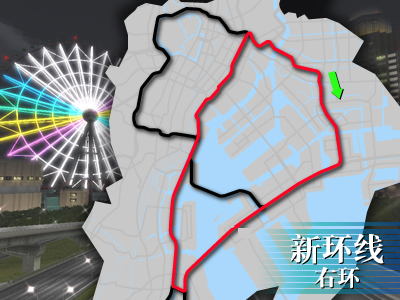 

[维基百科-新环状线](https://zh.wikipedia.org/zh-hans/首都高速9號深川線)

#### 八重州线

`迂回绕过C1并通过整排狭窄高楼及地下道，本路段崎岖险恶，需要高度技巧。还会有很多例如收费站这样的高难度障碍`

八重州外环

 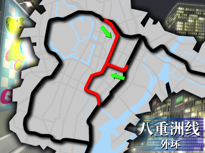 

八重州内环

 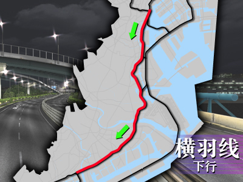 

[八重洲线](https://zh.wikipedia.org/wiki/首都高速八重洲線)

#### 横羽线

`神奈川县内的赛道，狭窄的高速路段，时不时地出现平缓的弯道`

横羽线上行

 
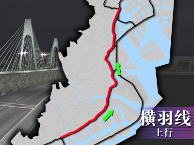 

横羽线下行

  

[横羽线](https://zh.wikipedia.org/wiki/首都高速神奈川1號橫羽線)

TODO:港未来

#### 部分放射线路

#### 沿路停车场

此mod可选择游戏内的出生停车场地点，分别是