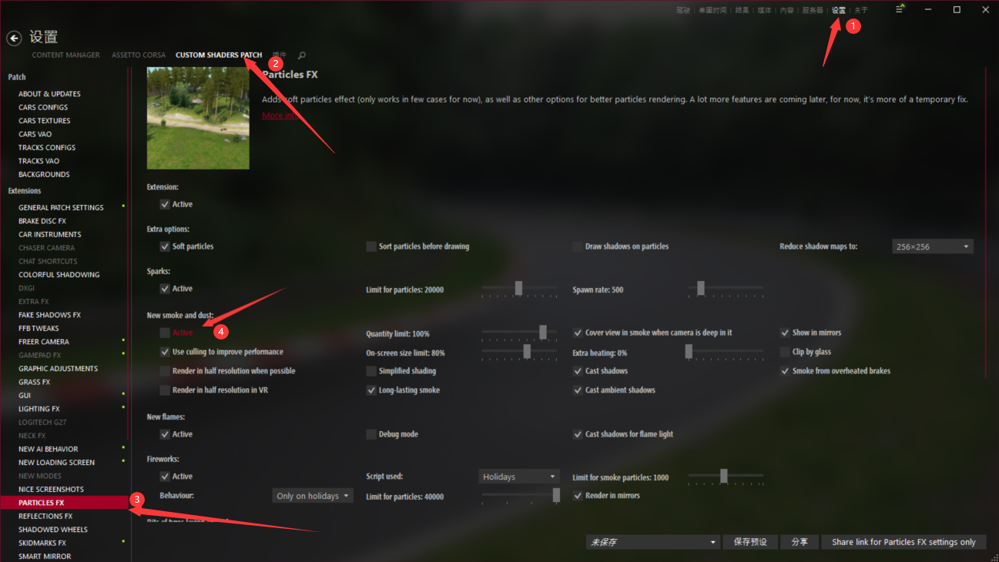

# SHMC服务器常见问题列表
`请注意，本页面仅仅描述在游玩本服务器时的常见问题，如果要查看更多问题，请查看`[常见问题导航](../page_errors/index.html)
`此站仍是测试阶段，可能会出现bug和内容缺失的情况`

## 游戏内问题

### *NPC车尾冒白烟*
::: details 查看
##### 解决方案

按照图内步骤操作后重进游戏

  

:::

### *车辆撞车后自己乱动，轮胎变形*
::: details 查看
##### 解决方案

车辆mod设计问题，无解决方案，避免重度碰撞即可

:::