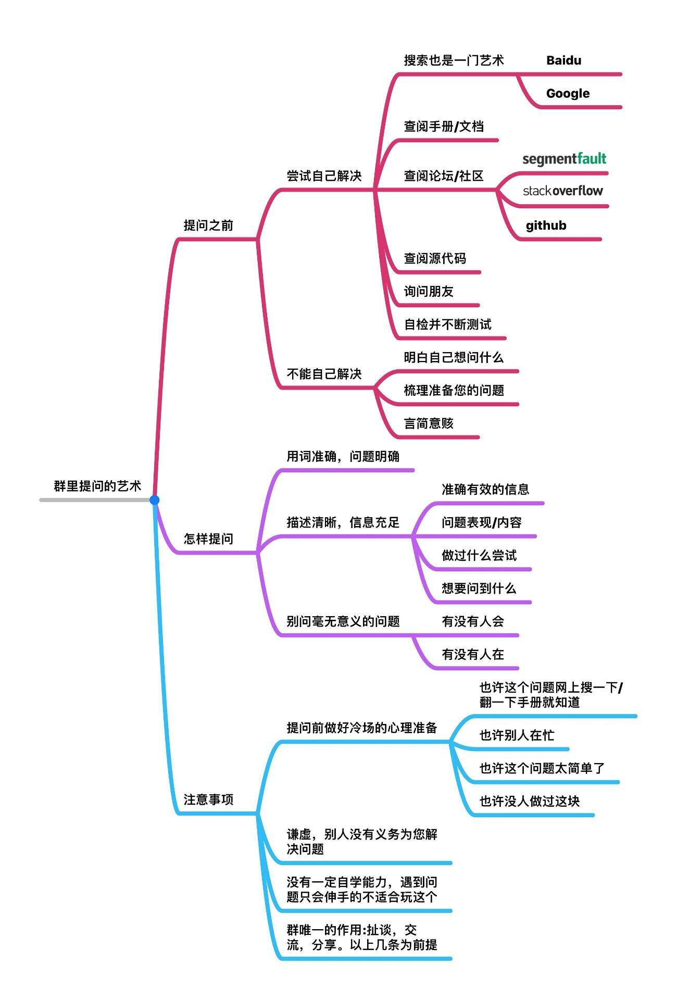

# 在群组提问

## 加入群组

官方discord群[链接]()（建议，对英语能力有一定要求）

非官方QQ群[链接]()

### 无法访问discord？

discord被GFW屏蔽，无法直接访问，请使用代理访问

### 如何安装并注册注册DC

谷歌搜索discord在找到官网下载安装，注册直接用手机号注册即可，DC支持官方中文

## 如何提问

1. 文档能解决的就不要提问

2. **清晰的，含有明确信息的报错或错误症状截图图片，日志**(如不知道如何获取日志点[这里]())，发送日志前先把日志改成.zip后缀再发送，**两者缺一不可**

3. **尽可能准确**的用文字描述你的问题，出现错误时的环境，如何复现错误

4. **态度端正**，回答，帮助你**不是其他人的义务**

5. **尽可能快的，完整**的回答帮助你的人的问题，不要说类似"明天吧"或是“我不知道，你想想”之类的话

6. 不要刷屏！！！

  

