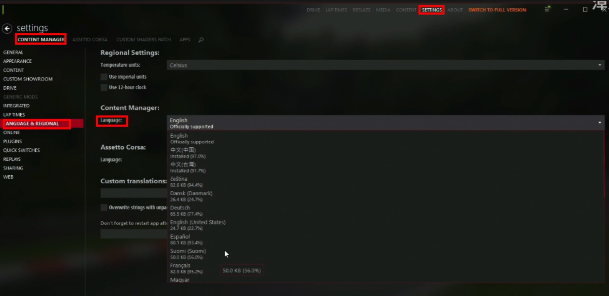

# 上海湾岸俱乐部
`此站仍是测试阶段，可能会出现bug和内容缺失的情况，下载功能还未上线，请勿使用，安装文件请在群文件内寻找`
## 关于我们

上海湾岸午夜俱乐部是一个国内的首都高服务器，旨在为国内玩家提供一个低延迟，本地化的游玩环境

## 必须游玩环境

### 必须条件
- 正版神力科莎
- 可正常联机游玩（网上购买的可能出现挤号的廉价共享账号无法正常联机）
- **全DLC**
- 在本地使用steam启动后可以正常游玩
- 满足[mod参考配置](../page_performance/performance_Reference.html#mod性能要求)的最低要求
### 如何获取？

1. 准备一个中国区账号
2. 在淘宝上搜索神力科莎全dlc，购买激活码(key)，直接购买全dlc是最便宜的；**一般售价为<u>22-26元</u>人民币**。如果是未成年人无法购买则推荐使用小黑盒购买，**售价为<u>29元</u>人民币**，原本账号里有神力科莎的会覆盖加上原来没有的dlc
3. 将收到的激活码复制，点击steam主页面的左下角的**加号按钮**，选择使用激活码添加游戏，在输入框复制激活码后点击确认，激活后dlc会自动下载

## 行为准则

首都高安全行车规定v1.1
- 请各位把游戏ID与群昵称改为一致，方便进行识别
- 首都高安全第一！量力而行，尽可能避免事故发生
- 如发生事故请第一时间撤离事故现场，继续行驶或前往不影响车流的安全位置 
- 请勿在任何行驶车道上停车，如需紧急停车请在不影响车流的紧急停车带上停车 
- 请勿在快车道（日本道路的最右车道）上慢行，如需慢行请走慢车道 
- 如有条件，在变道时请打转向灯，以免后车躲闪不及发生事故
- *禁止恶意冲撞其他玩家，如被恶意冲撞、鱼雷可提供录像作为证据*
- *禁止恶意冲撞路人车AI*
- *禁止恶意逆向行驶*
- 以上禁止事项，一经查实将采取永久封禁

【为创造一个舒适的首都高环境，请各位遵守以上规则，如有违反或遭举报将封禁处理】
## 如何游玩

:::danger 警告
请先查看上方的必须游玩环境避免问题，以及行为准则，这很重要，本服务器对恶意行为处罚从严
:::

<!--查看下列教程前请确保你安装有全dlc的正版神力科莎，如果没有安装请在上方查看-->

1. 请先加入我们的QQ群，群号：610506778，

2. 进入后，点击[这个链接](https://www.ip138.com) ，里面会显示你的ip地址

  

3. 将其和浏览器一起截图（截图快捷键win+shift+s）并私聊发送给名称叫“熊”的管理(不用加好友)。管理确认后会发送`1`

  

4. 下载群文件中的标明了`（必须下载）`的文件夹,和`缺少单个车包此处寻找`下的所有文件，并`关闭所有的杀毒软件！！`。SHMNC+日期的压缩包为车辆、SRP MAIN0.9.1_OFFICIAL.7z为首都高地图

  

5. 下载AC灯光终极整合包后双击运行安装至AC游戏根目录，安装完毕后启动content manger.exe进行设置

6. 将CM启动器设置为中文，步骤：点击顶部的`SETTINGS` → `LANGUAGE & REGIONAL`，在界面的`Language`选项中找到你想要的语言，点击，稍等片刻后点击下方的`Restart`按钮(重启按钮)即可，如果没有看到中文选项或选择并重启后未出现你设置的语言是正常现象，说明语言包还在加载，稍等2分钟后即可。

  

7. 将下载的SHMNC+日期压缩包全选（进入下载到的文件夹后按cltr+A）拖入CM启动器，上方会有一个三个横杠的图标亮起，表示已经检测到了mod

  

1. 点击这个按钮，会看到安装列表，点击文件中的`安装按钮`或是下方的`全部安装`

::: tip 提示
如果看到的是这个

  

[请点击这里尝试修复](../page_errors/error_cm.html#导入mod压缩包文件后无法识别-显示灰色和删除线和-failed)
如果是一直在加载
如果无效，请将下载的SHMNC+日期压缩包解压至AC根目录点击全部替换覆盖，将SRPMAIN091地图包解压至 AC根目录-content-tracks中
完成后重启CM或刷新后方可选车点击加入按钮进入服务器。使用CM自动安装可能由于杀软原因导致无法进入服务器 [查看如何使用覆盖根目录进行安装]()
:::

9. 重启CM，开着CM然后点击[这里](https://acstuff.ru/s/q:race/online/join?ip=124.221.83.227&httpPort=8081)进入服务器，在这个网页点击`join`之后浏览器会请求打开CM启动器，点击同意，CM启动器将会打开进入本服务器的窗口，进入一次之后就可以在CM启动器里的服务器页看到，无需再使用链接 

## 遇到问题？

### 如何诊断

可以先查阅[本服务器常见问题指南](../page_errors/error_shmc)，如果查找不到，可以进入站内的[常见问题导航](../page_errors/indexes)

如果始终无法找到问题，或者是无法解决，可以[寻求群内帮助](###如何提问)，请先查看文档再提问！
### 如何提问

1. 文档，群公告和百度能解决的就不要提问，先看群公告，**<u>简单问题自行百度</u>**

2. **<u>发送清晰的，含有明确信息的报错或错误症状截图图片，弹窗，日志</u>**(如不知道如何查看日志点[这里]())，发送日志前先把日志改成.zip后缀再发送，**至少发其中两个，复杂问题发日志**
::: warning 注意
请一定遵守本条要求，如果在群里什么线索都不发只是来一句“我进不去”，“咋不能用”就准备好冷场
:::

3. **尽可能准确**的用文字描述你的问题，出现错误时的环境

4. ***<u>态度端正</u>***，回答，帮助你**不是其他人的义务**

5. **尽可能快的，完整**的回答帮助你的人的问题，不要说类似"明天吧"或是“我不知道，你想想”之类的话

6. 不要刷屏！！！

  

<!-- ## 下载资源

###  -->